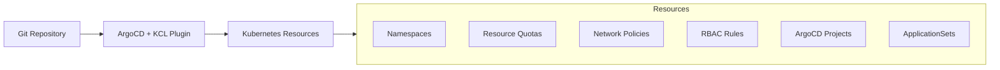
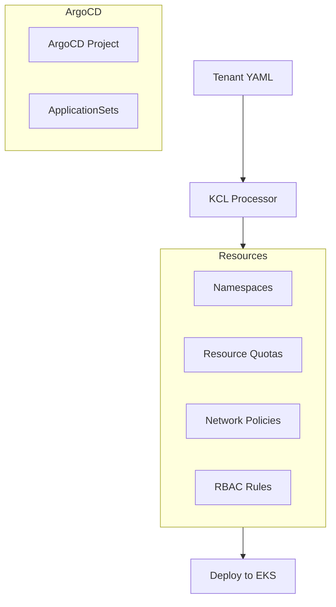
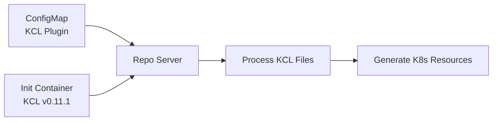
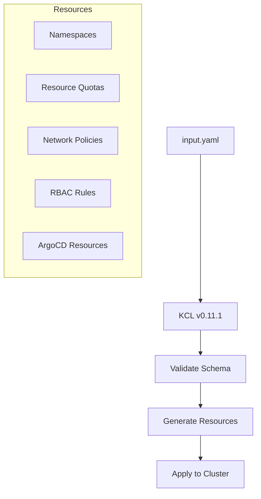
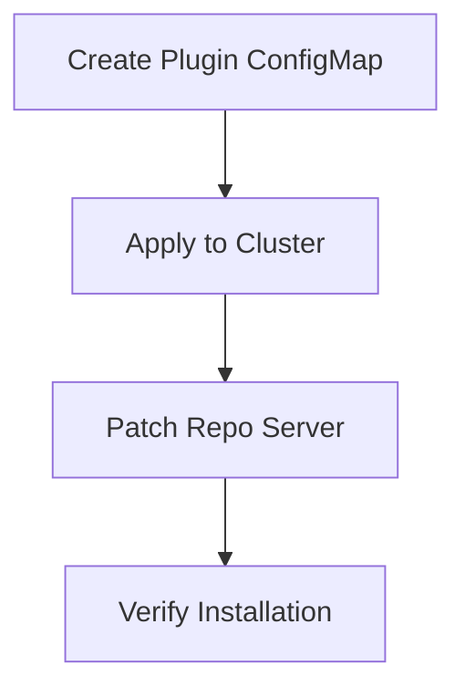
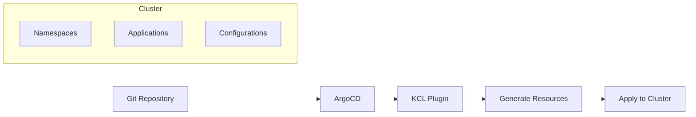
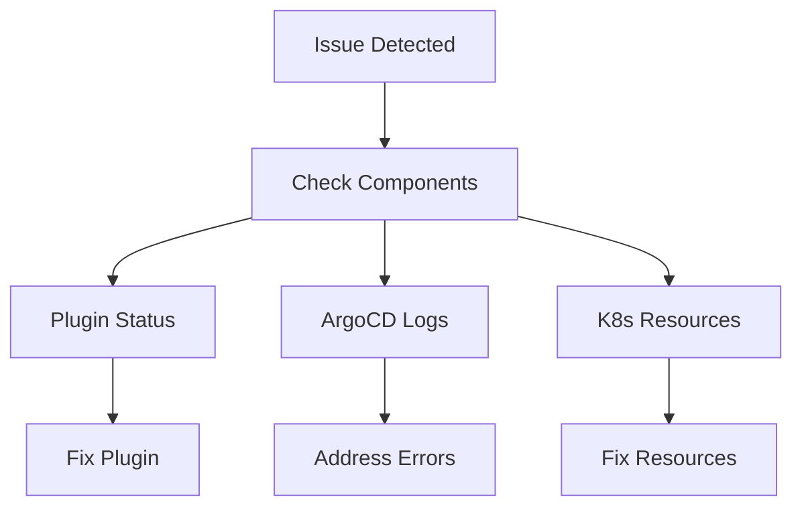

# EKS Tenant Manager: Multi-Tenant Kubernetes Management with KCL and ArgoCD

A GitOps-based solution for managing multiple tenants on Amazon EKS using KCL (v0.11.1) and ArgoCD.

## Architecture Overview



## Tenant Deployment Process



## Plugin Configuration Flow



## Resource Generation Flow



## Project Structure
```
.
├── base/                  # Core KCL configurations
│   ├── schema.k          # Resource schemas
│   ├── config.k          # Configuration loader
│   ├── common.k          # Common utilities
│   └── argo_schema.k     # ArgoCD schemas
├── resources/            # Resource generators
│   ├── namespace.k       # Namespace configuration
│   ├── quota.k          # Resource quotas
│   ├── limits.k         # Limit ranges
│   ├── network.k        # Network policies
│   ├── rbac.k           # RBAC rules
│   ├── applicationset.k  # ArgoCD ApplicationSets
│   └── argocd_project.k # ArgoCD Projects
├── bootstrap/           # Setup configurations
│   ├── kcl-plugin-config.yaml    # KCL plugin configuration
│   └── repo-server-patch.yaml    # ArgoCD repo server patch
└── tenants/             # Tenant configurations
    └── team-a/
        └── input.yaml   # Tenant definition
```

## Installation Steps

### 1. KCL Plugin Configuration



```yaml
# bootstrap/kcl-plugin-config.yaml
apiVersion: v1
kind: ConfigMap
metadata:
  name: kcl-plugin
  namespace: argocd
data:
  plugin.yaml: |
    apiVersion: argoproj.io/v1alpha1
    kind: ConfigManagementPlugin
    metadata:
      name: kcl
    spec:
      version: v1.0
      generate:
        command: ["sh", "-c"]
        args: ["kcl run -o yaml -D TENANT_FILE=$ARGOCD_APP_SOURCE_PATH/input.yaml"]
```

### 2. Repo Server Configuration

```yaml
# bootstrap/repo-server-patch.yaml
apiVersion: apps/v1
kind: Deployment
metadata:
  name: argocd-repo-server
  namespace: argocd
spec:
  template:
    spec:
      initContainers:
        - name: kcl-install
          image: alpine:3.15
          command: [sh, -c]
          args:
            - |
              wget -O /tmp/kcl.tar.gz https://github.com/kcl-lang/kcl/releases/download/v0.11.1/kclvm-v0.11.1-linux-amd64.tar.gz &&
              tar -xf /tmp/kcl.tar.gz -C /tmp &&
              mv /tmp/kclvm-v0.11.1-linux-amd64/bin/kcl /custom-tools/ &&
              chmod +x /custom-tools/kcl
          volumeMounts:
            - mountPath: /custom-tools
              name: custom-tools
      containers:
        - name: argocd-repo-server
          volumeMounts:
            - mountPath: /usr/local/bin/kcl
              name: custom-tools
              subPath: kcl
            - mountPath: /home/argocd/cmp-server/config/plugin.yaml
              name: kcl-plugin
              subPath: plugin.yaml
      volumes:
        - name: custom-tools
          emptyDir: {}
        - name: kcl-plugin
          configMap:
            name: kcl-plugin
```

## Application Deployment Flow



## Tenant Configuration Example

```yaml
name: team-a
env: prod
namespaces:
  - apps
  - tools
applications:
  - name: frontend
    gitRepo:
      url: https://github.com/team-a/frontend
      path: k8s/overlays/prod
      branch: main
      targetNamespace: apps
accessControl:
  groups:
    - name: apps-admin
      type: admin
      namespacePattern: "apps"
      iamRoles:
        - roleArn: "arn:aws:iam::123456789012:role/team-a-admin"
          username: "admin-user"
resourceQuota:
  cpu: "4"
  memory: "8Gi"
  pods: "20"
```

## Troubleshooting



### Common Issues
1. Plugin Installation
```bash
kubectl get configmap kcl-plugin -n argocd
kubectl get pods -n argocd -l app.kubernetes.io/name=argocd-repo-server
```

2. Resource Generation
```bash
kcl run -D TENANT_FILE=tenants/team-a/input.yaml
```

3. Application Sync
```bash
argocd app list
argocd app sync <app-name>
```

## Features
- ✅ KCL v0.11.1 compatibility
- ✅ Automated tenant provisioning
- ✅ Resource quota management
- ✅ Network isolation
- ✅ IAM integration
- ✅ GitOps workflow
- ✅ Multi-environment support

## Prerequisites
- Amazon EKS cluster
- ArgoCD installed
- KCL version 0.11.1
- kubectl configured
- Git repository access

## Contributing
Contributions are welcome! Please ensure you're using KCL v0.11.1 for compatibility.

## License
This project is licensed under the MIT License - see the LICENSE file for details.