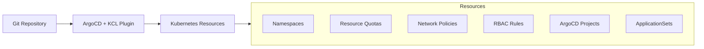
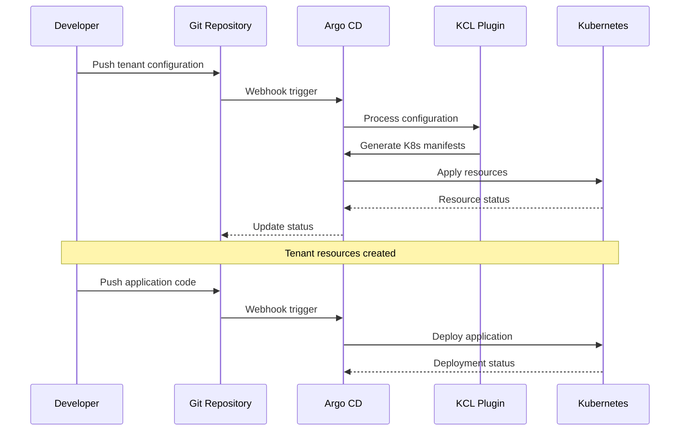

```markdown
# Amazon EKS Tenant Manager

## Motivation
Managing multiple tenants in a Kubernetes environment can be complex and challenging, especially when dealing with:
- Resource isolation and quota management
- Access control and security
- Configuration consistency
- Operational overhead
- Compliance and governance

This solution addresses these challenges by providing a GitOps-based approach to automate and standardize tenant management in Amazon EKS clusters.

## Introduction
The Amazon EKS Tenant Manager is a GitOps-based solution that leverages Argo CD and KCL (Kubernetes Configuration Language) to automate the management of multiple tenants in Amazon EKS clusters. It provides:

- **Declarative Tenant Management**: Define tenant configurations as code
- **Automated Resource Provisioning**: Automatically create and manage tenant resources
- **Standardized Access Control**: Implement consistent RBAC and security policies
- **Resource Quotas**: Enforce resource limits per tenant
- **GitOps Workflow**: Maintain desired state through Git
- **Multi-Environment Support**: Support for different environments (dev, staging, prod)

## Architecture



## Implementation Guide

### Prerequisites
- Amazon EKS cluster
- Argo CD (version 2.4+)
- KCL (version 0.11.1)
- kubectl configured with cluster access
- Git repository for storing configurations

### Installation Steps

1. **Install Argo CD**
```bash
kubectl create namespace argocd
kubectl apply -n argocd -f https://raw.githubusercontent.com/argoproj/argo-cd/stable/manifests/install.yaml
```

2. **Configure KCL Plugin**
Create a ConfigMap for the KCL plugin:

```bash
kubectl apply -f bootstrap/kcl-argocd-plugin.yaml
```

3. **Patch Argo CD Repo Server**
```bash
# Apply the patch
kubectl -n argocd patch deploy/argocd-repo-server -p "$(cat bootstrap/patch-argocd-repo-server.yaml)"

# Verify the patch
kubectl -n argocd get pods -l app.kubernetes.io/name=argocd-repo-server
```

4. **Create Tenant Configuration**
Create a tenant configuration file `clusters/dev/tenants/team-a/input.yaml`:

```yaml
name: team-a
env: prod
namespaces:
  - apps
  - tools
applications:
  - name: guestbook
    gitRepo:
      url: https://github.com/argoproj/argocd-example-apps/
      path: guestbook
      branch: HEAD
      targetNamespace: apps
  - name: backend
    gitRepo:
      url: https://github.com/team-a/backend
      path: k8s/overlays/prod
      targetNamespace: apps
accessControl:
  groups:
    - name: apps-admin
      type: admin
      namespacePattern: "apps"
      iamRoles:
        - roleArn: "arn:aws:iam::123456789012:role/team-a-admin"
          username: "admin-user"
resourceQuota:
  cpu: "4"
  memory: "8Gi"
  pods: "20"
limitRange:
  default:
    cpu: "500m"
    memory: "512Mi"
  defaultRequest:
    cpu: "100m"
    memory: "128Mi"
  max:
    cpu: "2"
    memory: "2Gi"
```

## Application Onboarding Sequence



## Verification Steps

```bash
# Check namespace creation
kubectl get ns apps tools

# Check resource quotas
kubectl describe resourcequota -n apps

# Check limit ranges
kubectl describe limitrange -n apps

# Check Argo CD applications
argocd app list

# Check RBAC configuration
kubectl get rolebindings -n apps

# Check plugin installation
kubectl -n argocd get configmap kcl-plugin
kubectl -n argocd get pods -l app.kubernetes.io/name=argocd-repo-server
```

## Project Structure
```
.
├── bootstrap                    # Bootstrap configurations
│   ├── kcl-argocd-plugin.yaml  # KCL plugin configuration for Argo CD
│   └── patch-argocd-repo-server.yaml # Repo server patch configuration
├── clusters                     # Multi-environment cluster configurations
│   ├── prod                     # Production environment
│   │   ├── applicationset.yaml # ApplicationSet configuration
│   │   ├── config             # KCL configurations
│   │   │   ├── base          # Base KCL schemas and configurations
│   │   │   │   ├── argocd_schema.k
│   │   │   │   ├── common.k
│   │   │   │   ├── config.k
│   │   │   │   └── schema.k
│   │   │   ├── kcl.mod       # KCL module definition
│   │   │   ├── kcl.mod.lock  # KCL module lock file
│   │   │   ├── main.k        # Main KCL entry point
│   │   │   └── resources     # Resource generators
│   │   │       ├── applicationset.k
│   │   │       ├── argocd_project.k
│   │   │       ├── limits.k
│   │   │       ├── namespace.k
│   │   │       ├── network.k
│   │   │       ├── quota.k
│   │   │       └── rbac.k
│   │   ├── project.yaml      # Argo CD project configuration
│   │   └── tenants          # Tenant-specific configurations
│   │       ├── team-a
│   │       │   └── input.yaml
│   │       └── team-b
│   │           └── input.yaml
│   ├── dev            # dev environment
│   └── staging              # Staging environment
└── README.md
```

Key components:
- **bootstrap/**: Contains initial setup configurations for Argo CD and KCL plugin
- **clusters/**: Multi-environment cluster configurations
  - **dev/**, **staging/**, **production/**: Environment-specific configurations
    - **config/**: KCL configurations and resource generators
    - **tenants/**: Tenant-specific configurations
    - **applicationset.yaml**: ApplicationSet definitions
    - **project.yaml**: Argo CD project configurations

Each environment follows the same structure, allowing for consistent yet customizable configurations across different stages of deployment.

## Features
- ✅ Automated tenant provisioning
- ✅ Resource quota management
- ✅ Network isolation
- ✅ IAM integration
- ✅ GitOps workflow
- ✅ Multi-environment support
- ✅ KCL v0.11.1 compatibility

## Contributing
Contributions are welcome! Please read our contributing guidelines first.

## License
This project is licensed under the MIT License - see the LICENSE file for details.
```