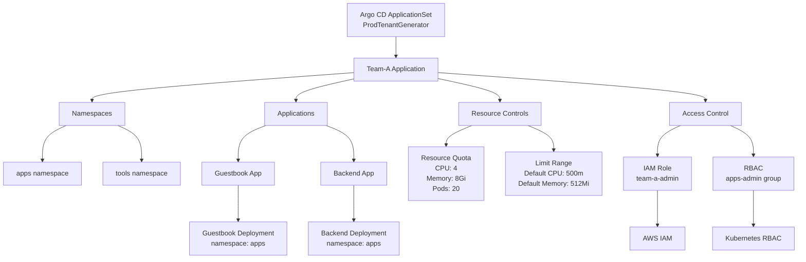

# Amazon EKS Tenant Manager: Automated Multi-Tenant Kubernetes Management with Argo CD

The Amazon EKS Tenant Manager is a GitOps-based solution that automates the management of multiple tenants in Amazon EKS clusters using Argo CD. It provides a declarative approach to tenant configuration, resource allocation, and access control, enabling teams to efficiently manage their Kubernetes resources while maintaining isolation and security.

This project implements a multi-tenant management system that handles tenant onboarding, namespace creation, resource quotas, and access control through a combination of Argo CD ApplicationSets and KCL (Kube Conformity Language). Teams can define their infrastructure requirements in YAML configurations, which are automatically translated into Kubernetes resources with proper isolation and security controls. The system supports fine-grained access control through IAM integration and enforces resource constraints through quotas and limit ranges.

## Repository Structure
```
.
├── bootstrap/
│   └── kcl-argocd-plugin.yaml      # Argo CD plugin configuration for KCL integration
├── clusters/
│   └── production/                  # Production environment configurations
│       ├── applicationset.yaml      # Tenant ApplicationSet generator configuration
│       ├── project.yaml            # Argo CD project definition for production
│       └── tenants/                # Tenant-specific configurations
│           ├── team-a/             # Team A tenant configuration
│           └── team-b/             # Team B tenant configuration
└── docs/                           # Documentation assets and diagrams
```

## Usage Instructions

### Prerequisites
- Amazon EKS cluster
- Argo CD installed and configured
- KCL CLI tool
- kubectl with cluster admin access
- Git repository access

### Installation

1. Install the KCL plugin for Argo CD:
```bash
kubectl apply -f bootstrap/kcl-argocd-plugin.yaml
```

2. Create the Argo CD project:
```bash
kubectl apply -f clusters/production/project.yaml
```

3. Deploy the ApplicationSet:
```bash
kubectl apply -f clusters/production/applicationset.yaml
```

### Quick Start

1. Create a new tenant configuration:
```yaml
# clusters/production/tenants/new-team/input.yaml
name: new-team
env: prod
namespaces:
  - apps
  - tools
accessControl:
  groups:
    - name: apps-admin
      type: admin
      namespacePattern: "apps"
      iamRoles:
        - roleArn: "arn:aws:iam::123456789012:role/new-team-admin"
          username: "admin-user"
```

2. Commit and push the configuration to the Git repository
3. Argo CD will automatically detect and apply the changes

### More Detailed Examples

**Example 1: Deploying Applications for a Tenant**
```yaml
applications:
  - name: guestbook
    gitRepo:
      url: https://github.com/argoproj/argocd-example-apps/
      path: guestbook
      branch: HEAD
      targetNamespace: apps
```

**Example 2: Setting Resource Quotas**
```yaml
resourceQuota:
  cpu: "4"
  memory: "8Gi"
  pods: "20"
limitRange:
  default:
    cpu: "500m"
    memory: "512Mi"
```

### Troubleshooting

**Issue: ApplicationSet not generating applications**
- Check the Argo CD ApplicationSet controller logs:
```bash
kubectl logs -n argocd -l app.kubernetes.io/name=argocd-applicationset-controller
```
- Verify the Git repository path pattern in applicationset.yaml
- Ensure tenant input.yaml files are in the correct location

**Issue: KCL plugin errors**
- Enable debug logging in Argo CD:
```bash
kubectl patch configmap/argocd-cm -n argocd --type merge -p '{"data":{"logging.level":"debug"}}'
```
- Check the Argo CD repo-server logs:
```bash
kubectl logs -n argocd -l app.kubernetes.io/name=argocd-repo-server
```

## Data Flow

The EKS Tenant Manager processes tenant configurations through a GitOps pipeline that transforms YAML definitions into Kubernetes resources using KCL and Argo CD.

```ascii
Git Repo                 Argo CD                     Kubernetes
[input.yaml] --> [ApplicationSet Generator] --> [Tenant Resources]
     |                    |                           |
     |                    v                           |
     |            [KCL Plugin Process]                |
     |                    |                           |
     +--------------------+---------------------------+
              Continuous Synchronization
```

Key component interactions:
1. ApplicationSet monitors the Git repository for tenant configurations
2. When a new tenant configuration is detected, ApplicationSet creates an Argo CD Application
3. The KCL plugin processes the tenant configuration file
4. KCL generates Kubernetes manifests for namespaces, RBAC, and resource quotas
5. Argo CD applies the generated manifests to the cluster
6. Changes to tenant configurations trigger automatic synchronization
7. Resource states are continuously monitored and reconciled

## Infrastructure




### Argo CD Resources
- **ApplicationSet**: `ProdTenantGenerator` (namespace: argocd)
  - Generates tenant applications from Git repository
  - Uses KCL plugin for manifest generation
  - Enables automated sync and pruning

### Kubernetes Resources
- **ConfigMap**: `kcl-plugin-config` (namespace: argocd)
  - Configures KCL plugin integration
  - Defines manifest generation commands

### Project Resources
- **AppProject**: `tenants-prod` (namespace: argocd)
  - Controls resource access and deployment destinations
  - Manages source repository permissions
  - Configures cluster resource access