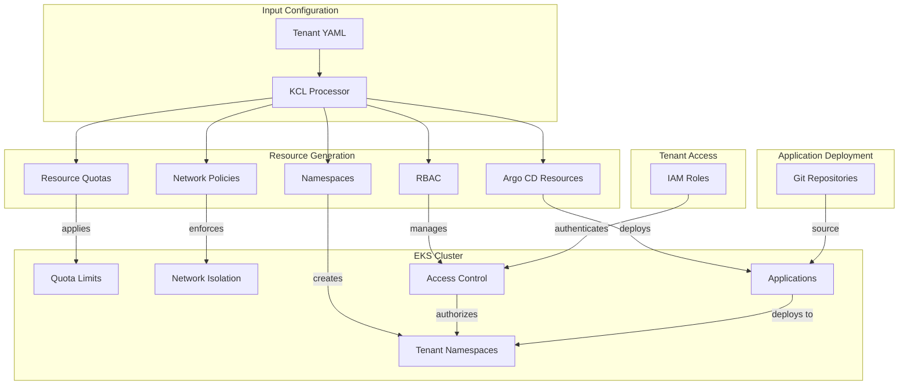
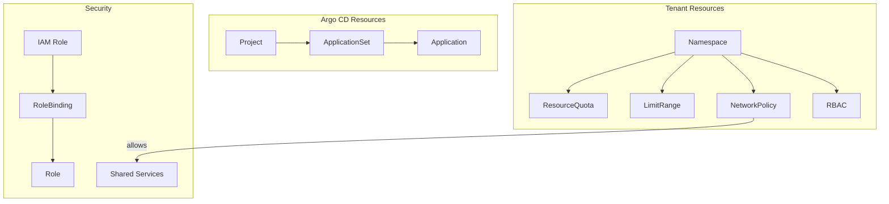
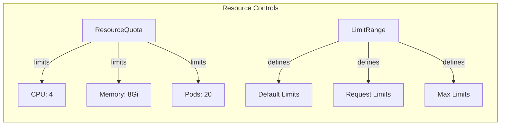
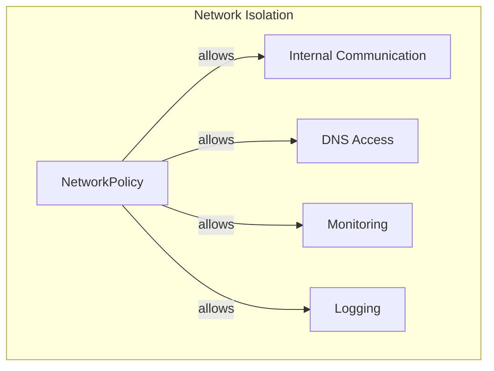
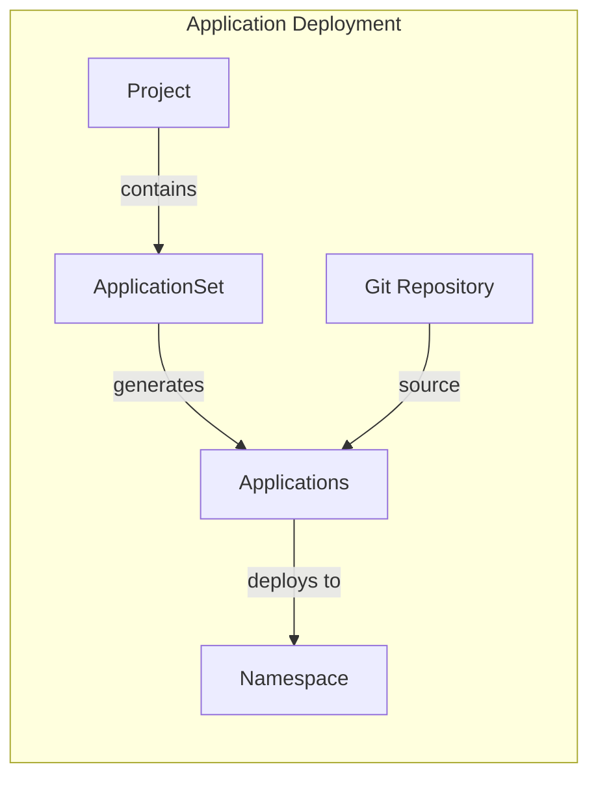
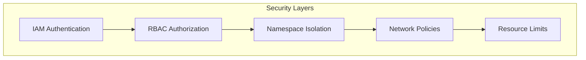

# Amazon EKS Multi-Tenant Configuration with KCL

This project provides a KCL-based configuration for managing multi-tenant environments on Amazon EKS. It automates the creation of namespaces, resource quotas, network policies, and Argo CD configurations for each tenant.

## Architecture



## Project Structure

```
.
├── base/
│   ├── schema.k          # Core schemas for resources
│   ├── config.k          # Configuration loader
│   ├── common.k          # Common utilities
│   └── argo_schema.k     # Argo CD specific schemas
├── resources/
│   ├── namespace.k       # Namespace resources
│   ├── quota.k          # Resource quotas
│   ├── limits.k         # Limit ranges
│   ├── network.k        # Network policies
│   ├── rbac.k           # RBAC configuration
│   ├── applicationset.k # Argo CD ApplicationSets
│   └── argocd_project.k # Argo CD Projects
└── tenants/
    └── team-a/
        └── input.yaml   # Tenant configuration
```

## Resource Overview



## Generated Resources

1. **Namespace Configuration**
   - Isolated namespaces per tenant
   - Resource quotas and limits
   - Network policies
   - RBAC configuration

2. **Resource Management**


3. **Network Policies**


4. **Argo CD Integration**


## Usage

1. Create tenant configuration:
```yaml
name: team-a
env: prod
namespaces:
  - apps
  - tools
applications:
  - name: frontend
    gitRepo:
      url: https://github.com/team-a/frontend
      path: k8s/overlays/prod
      targetNamespace: apps
```

2. Apply configuration:
```bash
kcl run -D TENANT_FILE=team-a/input.yaml | kubectl apply -f -
```

## Features

- ✅ Namespace Isolation
- ✅ Resource Quotas
- ✅ Network Policies
- ✅ RBAC Integration
- ✅ Argo CD Integration
- ✅ IAM Role Integration
- ✅ GitOps Workflow

## Requirements

- KCL version 0.11.1
- Amazon EKS cluster
- Argo CD installed
- kubectl configured

## Security Considerations



## Contributing

Contributions are welcome! Please read our contributing guidelines and submit pull requests.

## License

This project is licensed under the MIT License - see the LICENSE file for details.
