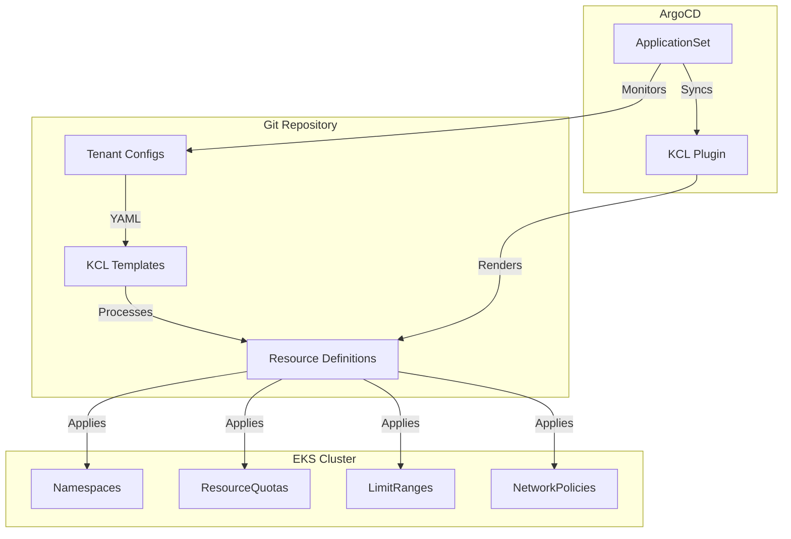

# Multi-Tenant Kubernetes Configuration on Amazon EKS with KCL

This repository provides KCL configurations for managing multi-tenant Kubernetes namespaces and associated resources using GitOps methodology with ArgoCD and KCL plugin.

## System Overview



## Architecture

The configuration implements a multi-tenant architecture with the following components:

### Configuration Layer
- Git-based tenant configuration in YAML format
- KCL templates for resource generation
- ArgoCD ApplicationSet for automated deployment

### Resource Management
- **Namespace Isolation**: Dedicated namespaces per tenant with proper labels and annotations
- **Resource Control**: 
  - CPU and memory quotas
  - Pod count limits
  - Service restrictions
  - ConfigMap and Secret limitations
- **Security Boundaries**:
  - Network isolation between tenants
  - Controlled DNS access
  - Default deny policies

### Deployment Flow
1. Tenant configurations are stored in Git
2. ArgoCD ApplicationSet detects changes
3. KCL plugin processes configurations
4. Resources are generated and validated
5. Changes are applied to the cluster

The configuration generates these Kubernetes resources per tenant:
- Namespaces with labels and annotations
- ResourceQuotas for resource management
- LimitRanges for container constraints
- NetworkPolicies for namespace isolation
  - Allows intra-tenant communication
  - Allows kube-dns access
  - Blocks all other traffic

## Directory Structure

```
.
├── base/
│   ├── schema.k          # Tenant and resource schemas
│   └── config.k          # Tenant configuration loader
├── resources/
│   ├── namespace.k       # Namespace resource generation
│   ├── quota.k          # ResourceQuota generation
│   ├── limits.k         # LimitRange generation
│   └── network.k        # NetworkPolicy generation
├── tenants/             # Tenant YAML configurations
│   ├── team-a.yaml
│   └── team-b.yaml
└── main.k               # Main resource compilation
```

## Prerequisites

- KCL v0.11.1
- ArgoCD with KCL plugin
- Kubernetes cluster access

## Usage

### Tenant Configuration

Create tenant configurations in `tenants/` directory:

```yaml
# tenants/team-a.yaml
name: team-a
env: production
namespaces: 
  - team-a-ns1
  - team-a-ns2
resourceQuota:
  cpu: "4"
  memory: "8Gi"
  pods: "20"
  services: "10"
  configmaps: "20"
  secrets: "20"
limitRange:
  default:
    cpu: "500m"
    memory: "512Mi"
  defaultRequest:
    cpu: "100m"
    memory: "128Mi"
  max:
    cpu: "2"
    memory: "2Gi"
```

### Local Testing

```bash
# Validate configuration
kcl run

# Apply to cluster
kcl run | kubectl apply -f -
```

## Application Onboarding

Follow these steps to onboard a new application into the multi-tenant environment:

1. **Tenant Resource Definition**
   ```yaml
   # Create a new tenant YAML file in tenants/ directory
   name: <team-name>
   env: <environment>
   namespaces:
     - <app-namespace-1>
     - <app-namespace-2>
   resourceQuota:
     cpu: "<quota>"
     memory: "<quota>"
     pods: "<quota>"
     services: "<quota>"
     configmaps: "<quota>"
     secrets: "<quota>"
   limitRange:
     default:
       cpu: "<limit>"
       memory: "<limit>"
     defaultRequest:
       cpu: "<request>"
       memory: "<request>"
     max:
       cpu: "<max>"
       memory: "<max>"
   ```

2. **ArgoCD Configuration**
   ```yaml
   # Create an Application resource for your tenant
   apiVersion: argoproj.io/v1alpha1
   kind: Application
   metadata:
     name: <team-name>-tenant
     namespace: argocd
   spec:
     project: default
     source:
       repoURL: https://github.com/jihed/amazon-eks-multitenant-cluster.git
       targetRevision: HEAD
       path: .
       plugin:
         name: kcl-v1.0
     destination:
       server: https://kubernetes.default.svc
       namespace: default
     syncPolicy:
       automated:
         prune: true
         selfHeal: true
   ```

3. **Deployment Process**
   1. Submit tenant configuration as a pull request
   2. Upon merge, ArgoCD ApplicationSet detects the new configuration
   3. KCL plugin processes the configuration and generates resources
   4. ArgoCD applies the resources to the cluster
   5. Verify namespace creation and resource constraints

4. **Validation Steps**
   ```bash
   # Verify namespace creation
   kubectl get ns | grep <team-name>

   # Check resource quotas
   kubectl get resourcequota -n <app-namespace>

   # Verify limit ranges
   kubectl get limitrange -n <app-namespace>

   # Test network policies
   kubectl get networkpolicies -n <app-namespace>
   ```

5. **Post-Deployment Verification**
   - Confirm namespace isolation
   - Validate resource quotas
   - Test network policies
   - Verify DNS access
   - Check ArgoCD sync status

## ArgoCD Integration

1. Install ArgoCD KCL plugin
2. Create ArgoCD Application:

```yaml
apiVersion: argoproj.io/v1alpha1
kind: Application
metadata:
  name: tenant-namespaces
  namespace: argocd
spec:
  project: default
  source:
    repoURL: https://github.com/jihed/amazon-eks-multitenant-cluster.git
    targetRevision: HEAD
    path: .
    plugin:
      name: kcl-v1.0
  destination:
    server: https://kubernetes.default.svc
    namespace: default
  syncPolicy:
    automated:
      prune: true
      selfHeal: true
```

## Generated Resources

### Namespace
- Labels:
  - team
  - environment
  - managed-by: kcl

### ResourceQuota
Configurable limits for:
- CPU
- Memory
- Pods
- Services
- ConfigMaps
- Secrets

### LimitRange
Container constraints for:
- Default limits
- Default requests
- Maximum limits

### NetworkPolicy
- Allows communication between tenant namespaces
- Allows DNS access (UDP/TCP port 53)
- Blocks other traffic

## Best Practices

### GitOps Workflow
- Make changes through git
- Use ArgoCD for deployment
- Monitor sync status

### Tenant Management
- One YAML file per tenant
- Use meaningful namespace names
- Document resource quotas

### Version Control
- Commit all changes
- Use branch protection
- Review changes

## Troubleshooting

### ArgoCD Sync Issues
- Verify KCL plugin installation
- Check YAML syntax
- Validate resources

### Resource Conflicts
- Check namespace uniqueness
- Verify quota settings
- Review network policies

## Contributing

1. Fork repository
2. Create feature branch
3. Submit pull request

## Support

Create an issue in the repository for:
- Bug reports
- Feature requests
- Documentation improvements

Let me know if you need any clarification or have questions!