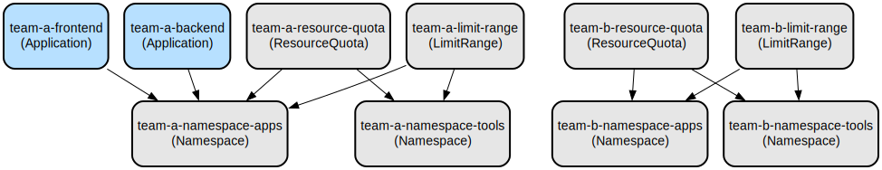

# Amazon EKS Tenant Manager: Automated Multi-Tenant Kubernetes Management with Argo CD

The Amazon EKS Tenant Manager is a GitOps-based solution that automates the management of multiple tenants in Amazon EKS clusters using Argo CD. It provides a declarative approach to tenant configuration, resource management, and access control, enabling teams to efficiently manage their Kubernetes resources while maintaining isolation and security.

This project implements a multi-tenant architecture that automatically provisions and manages tenant namespaces, resource quotas, and access controls through GitOps practices. It leverages Argo CD's ApplicationSet controller and KCL (Kube Conformity Language) plugin to generate and maintain Kubernetes manifests based on tenant-specific configurations. The solution supports fine-grained access control through IAM role integration, resource quotas enforcement, and automated application deployment across tenant spaces.

## Repository Structure
```
.
├── bootstrap/
│   └── kcl-argocd-plugin.yaml     # Argo CD plugin configuration for KCL integration
├── clusters/
│   └── production/                 # Production environment configurations
│       ├── applicationset.yaml     # Tenant ApplicationSet generator configuration
│       ├── project.yaml           # Argo CD project definition for production
│       └── tenants/               # Tenant-specific configurations
│           ├── team-a/            # Team A tenant configuration
│           └── team-b/            # Team B tenant configuration
└── docs/                          # Documentation assets
```

## Usage Instructions

### Prerequisites
- Amazon EKS cluster
- Argo CD installed and configured on the cluster
- kubectl CLI tool
- Access to AWS IAM for role configuration
- Git repository access

### Installation

1. Install the KCL plugin for Argo CD:
```bash
kubectl apply -f bootstrap/kcl-argocd-plugin.yaml
```

2. Create the Argo CD project:
```bash
kubectl apply -f clusters/production/project.yaml
```

3. Deploy the ApplicationSet:
```bash
kubectl apply -f clusters/production/applicationset.yaml
```

### Quick Start

1. Create a new tenant configuration:
```yaml
# clusters/production/tenants/new-team/input.yaml
name: new-team
env: prod
namespaces:
  - apps
  - tools
accessControl:
  groups:
    - name: apps-admin
      type: admin
      namespacePattern: "apps"
      iamRoles:
        - roleArn: "arn:aws:iam::123456789012:role/new-team-admin"
          username: "admin-user"
```

2. Commit and push the configuration to the Git repository
3. Argo CD will automatically detect and apply the new tenant configuration

### More Detailed Examples

#### Configuring Resource Quotas
```yaml
resourceQuota:
  cpu: "4"
  memory: "8Gi"
  pods: "20"
limitRange:
  default:
    cpu: "500m"
    memory: "512Mi"
  defaultRequest:
    cpu: "100m"
    memory: "128Mi"
  max:
    cpu: "2"
    memory: "2Gi"
```

#### Deploying Applications for a Tenant
```yaml
applications:
  - name: guestbook
    gitRepo:
      url: https://github.com/argoproj/argocd-example-apps/
      path: guestbook
      branch: HEAD
      targetNamespace: apps
```

### Troubleshooting

#### Common Issues

1. ApplicationSet not generating applications
- Check ApplicationSet status:
```bash
kubectl get applicationset -n argocd
kubectl describe applicationset ProdTenantGenerator -n argocd
```
- Verify Git repository access and path patterns

2. KCL Plugin Issues
- Check plugin configuration:
```bash
kubectl get configmap kcl-plugin-config -n argocd -o yaml
```
- Verify plugin logs:
```bash
kubectl logs -n argocd -l app.kubernetes.io/name=argocd-repo-server
```

## Data Flow

The tenant management system processes configurations through a GitOps pipeline that transforms tenant definitions into Kubernetes resources.

```ascii
Git Repo                    Argo CD                         Kubernetes
[Tenant Config] --> [ApplicationSet Generator] --> [Tenant Resources]
     |                         |                         |
     |                    KCL Plugin                    |
     |                   Transforms &                   |
     └------------------Validates---------------------->|
```

Key component interactions:
1. ApplicationSet monitors the Git repository for tenant configuration changes
2. When changes are detected, the KCL plugin processes the tenant configuration
3. The plugin generates Kubernetes manifests based on tenant specifications
4. Argo CD applies the generated manifests to the cluster
5. Resources are created/updated in the appropriate tenant namespaces
6. IAM roles and permissions are configured for tenant access
7. Resource quotas and limits are enforced per tenant specification

## Infrastructure



### Argo CD Resources
- **AppProject**: `tenants-prod` (namespace: argocd)
  - Manages production tenant resources
  - Allows deployment to all namespaces
  - Whitelists all cluster resources

- **ApplicationSet**: `ProdTenantGenerator` (namespace: argocd)
  - Generates tenant applications from Git repository
  - Uses KCL plugin for manifest generation
  - Implements automated sync policy

### Kubernetes Resources
- **ConfigMap**: `kcl-plugin-config` (namespace: argocd)
  - Configures KCL plugin integration
  - Defines manifest generation commands
  - Sets environment variable handling


  graph TD
    subgraph "ArgoCD Resources"
        A[AppProject<br/>team-a-prod] --> |contains| AS1[ApplicationSet<br/>team-a-prod-frontend]
        A --> |contains| AS2[ApplicationSet<br/>team-a-prod-backend]
        A --> |contains| AS3[ApplicationSet<br/>team-a-prod-monitoring]
    end

    subgraph "Namespace: team-a-prod-apps"
        NS1[Namespace] --> RQ1[ResourceQuota]
        NS1 --> LR1[LimitRange]
        NS1 --> NP1[NetworkPolicy]
        NS1 --> R1[Role]
        NS1 --> RB1[RoleBinding]
    end

    subgraph "Namespace: team-a-prod-tools"
        NS2[Namespace] --> RQ2[ResourceQuota]
        NS2 --> LR2[LimitRange]
        NS2 --> NP2[NetworkPolicy]
        NS2 --> R2[Role]
        NS2 --> RB2[RoleBinding]
    end

    subgraph "Resource Details"
        RQ1 --> |limits| Q1[CPU: 4<br/>Memory: 8Gi<br/>Pods: 20]
        LR1 --> |contains| L1[Default/Request/Max<br/>CPU & Memory limits]
        NP1 --> |allows| NET1[Ingress/Egress<br/>Team & Shared Services]
        R1 --> |defines| RBAC1[Admin/Developer<br/>Permissions]
        RB1 --> |binds to| IAM1[IAM Roles]
    end

    subgraph "ArgoCD Applications Flow"
        AS1 --> |creates| APP1[Application<br/>frontend]
        AS2 --> |creates| APP2[Application<br/>backend]
        AS3 --> |creates| APP3[Application<br/>monitoring]
        APP1 --> |deploys to| NS1
        APP2 --> |deploys to| NS1
        APP3 --> |deploys to| NS2
    end

    subgraph "Source Repositories"
        GH1[github.com/team-a/frontend]
        GH2[github.com/team-a/backend]
        GH3[github.com/team-a/monitoring]
        APP1 --> |syncs from| GH1
        APP2 --> |syncs from| GH2
        APP3 --> |syncs from| GH3
    end